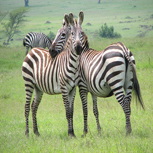
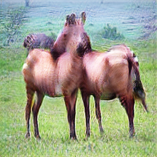
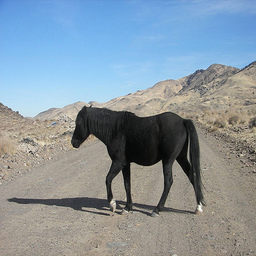
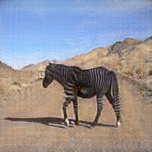

# CycleGAN
#### выполнил Маслов Павел
В ходе выполнения работы был разрабан алгоритм 
генеративно-состязательной сети CycleGAN
в соответствии со статьей 
**Unpaired Image-to-Image Translation
using Cycle-Consistent Adversarial Networks**
(<https://arxiv.org/pdf/1703.10593.pdf>)
###Загрузка проекта

    git clone https://github.com/PaulFirst/CycleGAN.git
    pip install -r requirements.txt
    bash ./bin/download_horse2zebra.sh
    bash ./bin/download_person2avatar.sh
###Тестирование на horse2zebra
    python3 ./src/train.py --weight_path ./h2zCycleGAN.pth --task horse2zebra
###Тестирование на person2avatar
    python3 ./src/train.py --weight_path ./p2aCycleGAN.pth --task person2avatar
Результаты появлятся в папке test_results

###Результаты работы обученной модели
####Лошадь-Зебра
Модель была обучена в течении 60 эпох (что несколько мало,
так как качество можно еще улучшить) на наборе данных
horse2zebra для проверки ее способности выполнять перенос стиля.
Даже при данном уровне качества можно отметить, что модель является сбалансированной
(не взрывов или коллапсов), а занчит большая вероятность, что на последующих
эпохах эксцессов также не случится. Поэтому в силу ограничения времени
было решено остановиться на результатах, приведенных ниже, которые
несмотря на погрешности показывают, что сеть производит избирательный перенос стиля.

Резульаты преобразований в обе стороны (лошадь-зебра, зебра-лошадь)

.png)
.png) 
---

___
.png)
.png)
___

#####Человек-Персонаж "Аватара"
В качестве собственного датасета был создан небольшой датасет
(по 100 картинок, что в общем мало, но сделано вручную), в котором
лица реальных людей были взяты из набора VoxCeleb1, а персонаж из
народа фильма "Аватар" путем непосредственного кадрирования одноименного
фильма.
Результаты отображения человека в аватара приведены на рисунках ниже (обратное отображение бессмысленно, поскольку синий человечек превращается в белого, что не есть привлекательно)
. Можно заметить выделение желтым цветом глаз, а также появление текстуры на лице и небольшие розоватости на ушах.

.png)
.png)
---
.png)
.png)